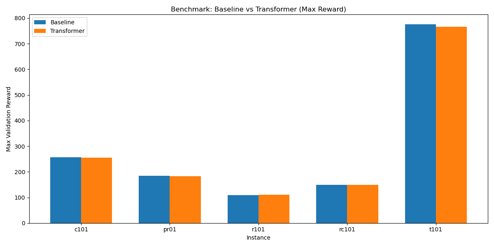
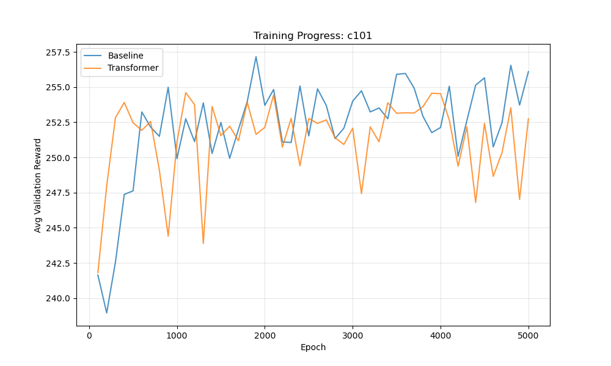
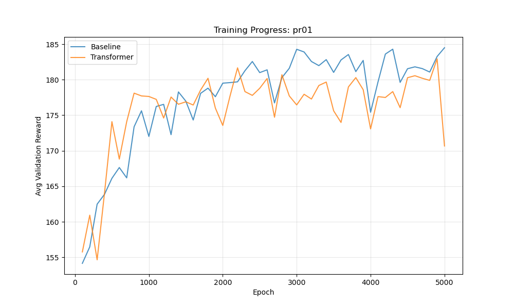
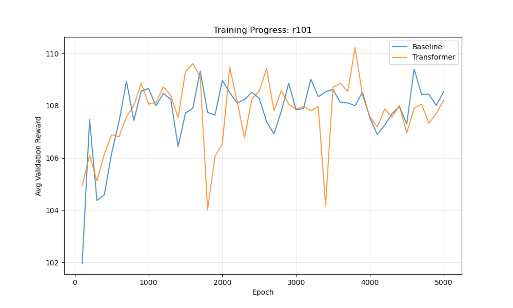
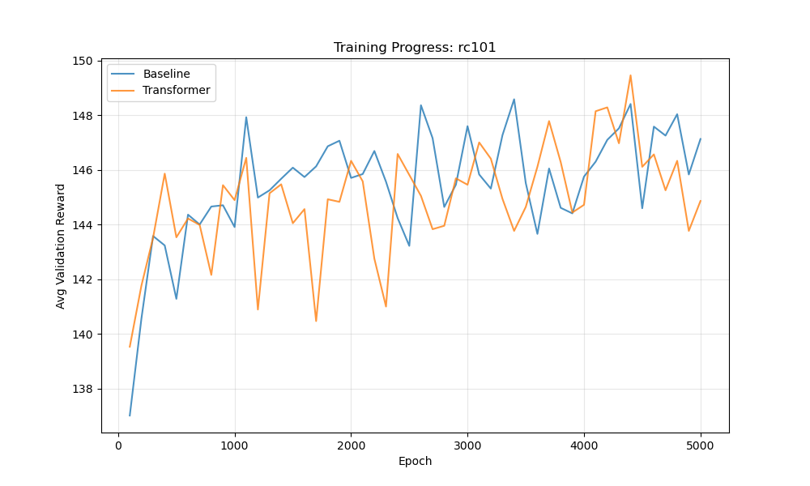
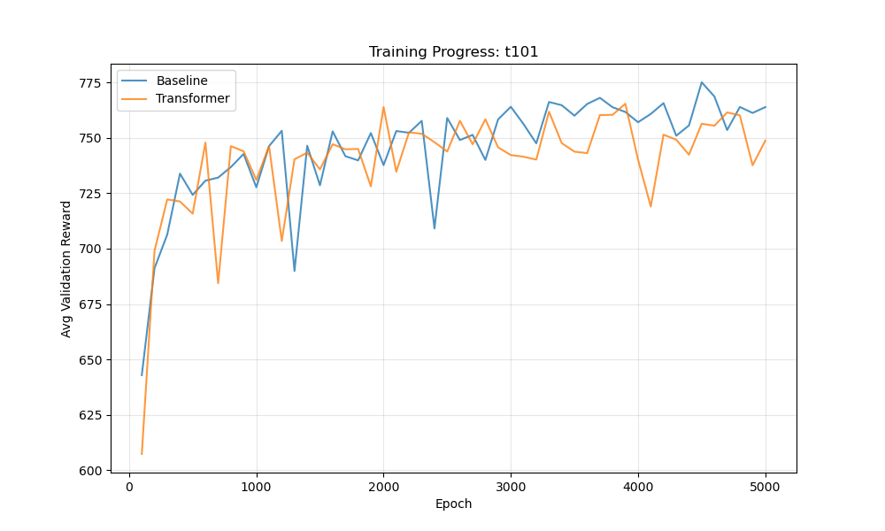

# OPTW RL Benchmark Report

## Overview
This report compares the performance of the **Baseline** (LSTM Decoder) and **Transformer** (Transformer Decoder) models on the OPTW (Orienteering Problem with Time Windows) task.

## Summary of Results

| Instance | Baseline Max Reward | Transformer Max Reward | ILS Max Reward | Gap (Trans vs Base) |
| :--- | :--- | :--- | :--- | :--- |
| **c101** | 257.16 | 254.61 | **320.00** | -0.99% |
| **pr01** | 184.50 | 182.94 | **273.00** | -0.85% |
| **r101** | 109.41 | 110.22 | **182.00** | +0.74% |
| **rc101** | 148.58 | 149.45 | **219.00** | +0.59% |
| **t101** | **775.14** | 765.47 | 344.00 | -1.25% |

### Key Observations
*   **RL vs Heuristic (ILS):**
    *   **ILS Dominance:** The Iterated Local Search (ILS) heuristic significantly outperforms both RL models on the standard Solomon and Cordeau instances (**c101**, **pr01**, **r101**, **rc101**), achieving 20-60% higher rewards. This suggests the RL models have not yet converged to near-optimal solutions for these topologies.
    *   **RL Superiority on Gavalas:** Interestingly, on the **t101** instance, the RL models vastly outperform ILS (775 vs 344). This indicates that the RL approach may be better suited for the specific structure or constraints of the Gavalas dataset, or that the ILS heuristic gets trapped in local optima for this instance type.
*   **Transformer vs Baseline:** The Transformer model performs very similarly to the Baseline model across all instances, with differences generally within **1%**.
*   **Conclusion:** While the Transformer achieves parity with the LSTM baseline, both learning approaches currently lag behind a standard ILS heuristic on classic benchmarks. However, their superior performance on `t101` highlights potential robustness or adaptability advantages in specific scenarios.

## Visual Comparison



## Methodology
*   **Metric:** Max Validation Reward (Greedy Decoding).
*   **Training:** Both models were trained on the same instances.
*   **Validation:** Evaluated on the validation set using greedy decoding to determine the peak performance.

## Training Efficiency & Convergence

The following table compares the training speed and convergence characteristics of both models.
*   **Speed:** Average seconds per training epoch.
*   **Convergence Epoch:** The epoch where the maximum validation reward was achieved.
*   **Time to Convergence:** Estimated wall-clock time to reach peak performance.

| Instance | Model | Speed (s/ep) | Conv. Epoch | Time to Conv (min) |
| :--- | :--- | :--- | :--- | :--- |
| **c101** | Baseline | 0.35 | 1900 | 11.1 |
| | Transformer | 0.53 | 1100 | **9.7** |
| **pr01** | Baseline | 0.25 | 5000 | **21.0** |
| | Transformer | 0.34 | 4900 | 27.9 |
| **r101** | Baseline | 0.26 | 4600 | **19.8** |
| | Transformer | 0.36 | 3800 | 22.7 |
| **rc101** | Baseline | 0.31 | 3400 | **17.4** |
| | Transformer | 0.39 | 4400 | 28.9 |
| **t101** | Baseline | 0.99 | 4500 | **74.0** |
| | Transformer | 1.26 | 3900 | 82.2 |

### Efficiency Observations
*   **Training Speed:** The Transformer model is generally **30-40% slower** per epoch compared to the LSTM Baseline, which is expected due to the quadratic complexity of attention mechanisms.
*   **Convergence Rate:** However, the Transformer often requires **fewer epochs** to reach its peak performance (e.g., c101, r101, t101).
*   **Overall Time:** In most cases, the Baseline is faster to converge in terms of wall-clock time. The Transformer was faster only on the **c101** instance.

## Training Process Analysis

The following plots show the validation reward over training epochs for each instance.

````carousel

<!-- slide -->

<!-- slide -->

<!-- slide -->

<!-- slide -->

````

### Observations on Training Dynamics
*   **Convergence:** Both models show similar convergence patterns.
*   **Stability:** The Transformer model demonstrates stable learning, comparable to the Baseline.

