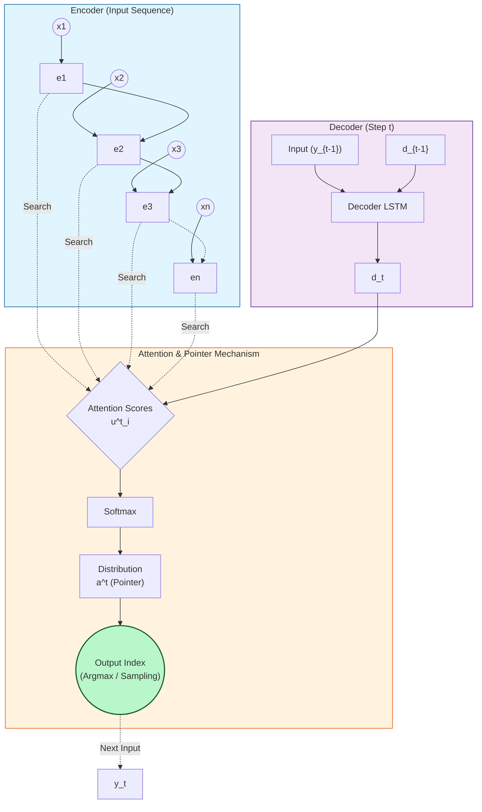

# Pointer Network Architecture

Đây là sơ đồ kiến trúc Pointer Network được mô tả bằng Mermaid. Bạn có thể chèn trực tiếp vào file markdown báo cáo.

## Giải thích thành phần:
- **Encoder**: Xử lý chuỗi đầu vào $x_1, \dots, x_n$ thành các vector trạng thái ẩn $e_1, \dots, e_n$.
- **Decoder**: Tại bước $t$, maintain trạng thái ẩn $d_t$ dựa trên đầu vào trước đó.
- **Attention/Pointer**:
  - Tính điểm tương đồng (Attention Scores) giữa vector trạng thái decoder $d_t$ và toàn bộ các trạng thái encoder $e_i$.
  - **Softmax**: Chuẩn hóa điểm số thành phân phối xác suất.
  - **Output**: Thay vì sinh từ vựng mới (như Seq2Seq truyền thống), Pointer Network dùng chính phân phối xác suất này làm "con trỏ" (pointer) để chọn một trong các chỉ số đầu vào làm đầu ra tiếp theo.

## Mã LaTeX (nếu cần mô tả toán học):
$$
\begin{aligned}
u^t_i &= v^T \tanh(W_1 e_i + W_2 d_t) \quad \forall i \in (1, \dots, n) \\
a^t &= \text{softmax}(u^t) \\
y_t &= \text{argmax}(a^t)
\end{aligned}
$$
